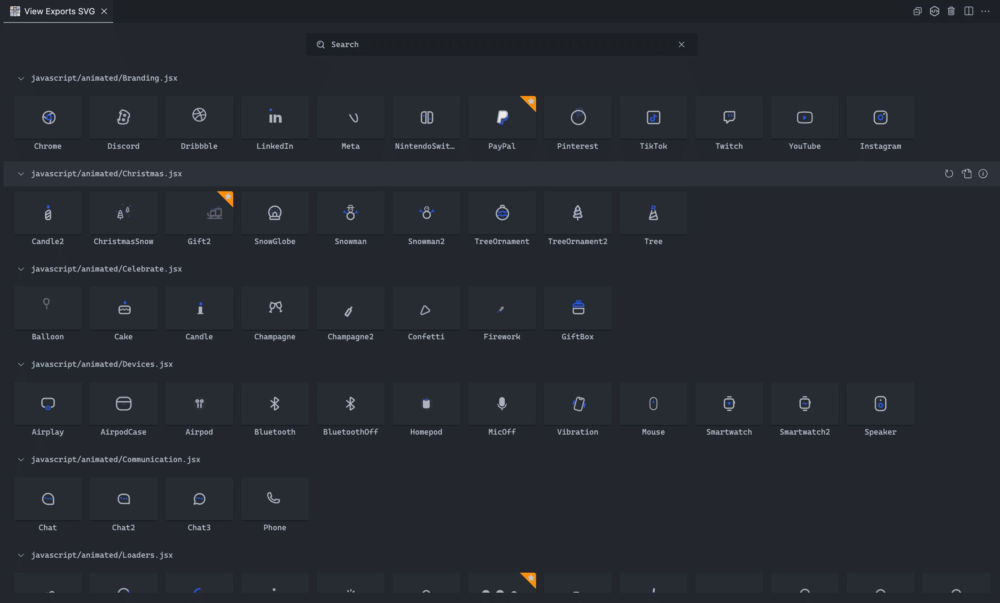
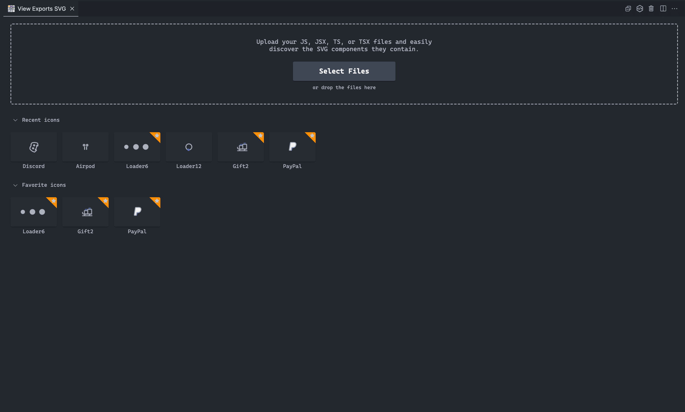

# View Exports SVG: Simplify Icon Exploration in Visual Studio Code

**Discover the convenience of exploring and searching for SVG icons exported from JavaScript, JSX, TypeScript, or TSX files with the powerful 'View Exports SVG' extension for Visual Studio Code.**

Enhance your creative workflow by visualizing all your icon assets in one central location. Optimize your development process and bring your icons to life with this essential tool for developers!

